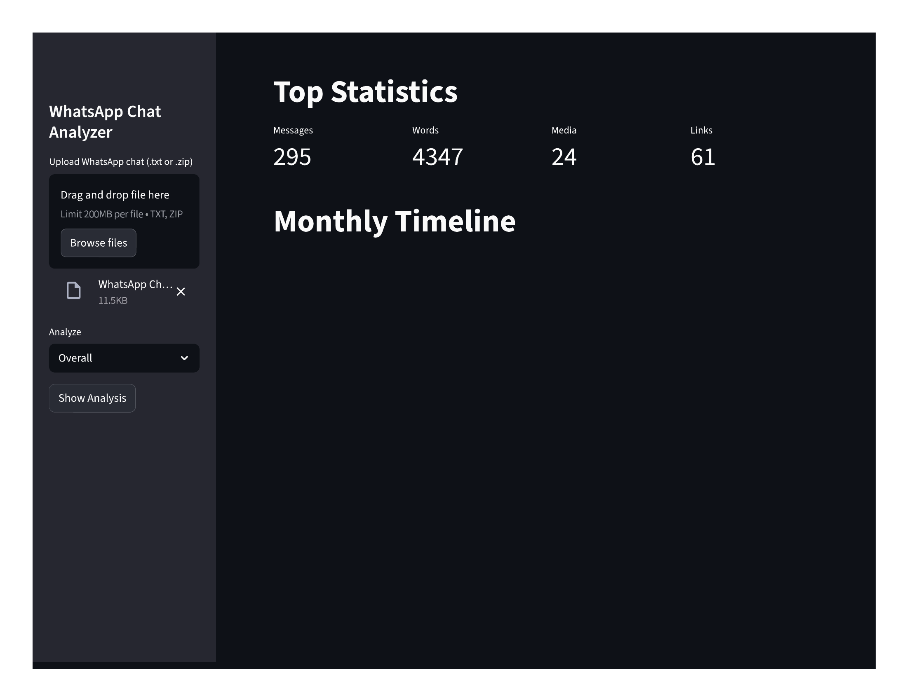
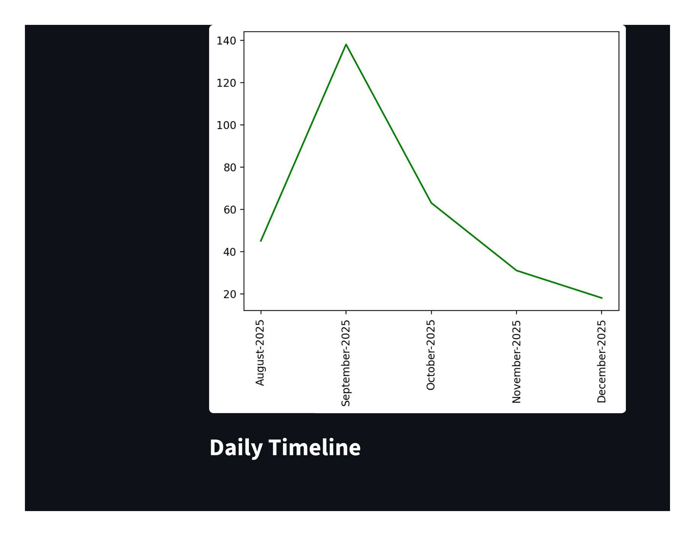
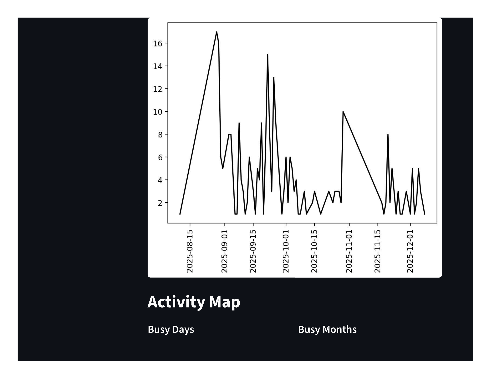
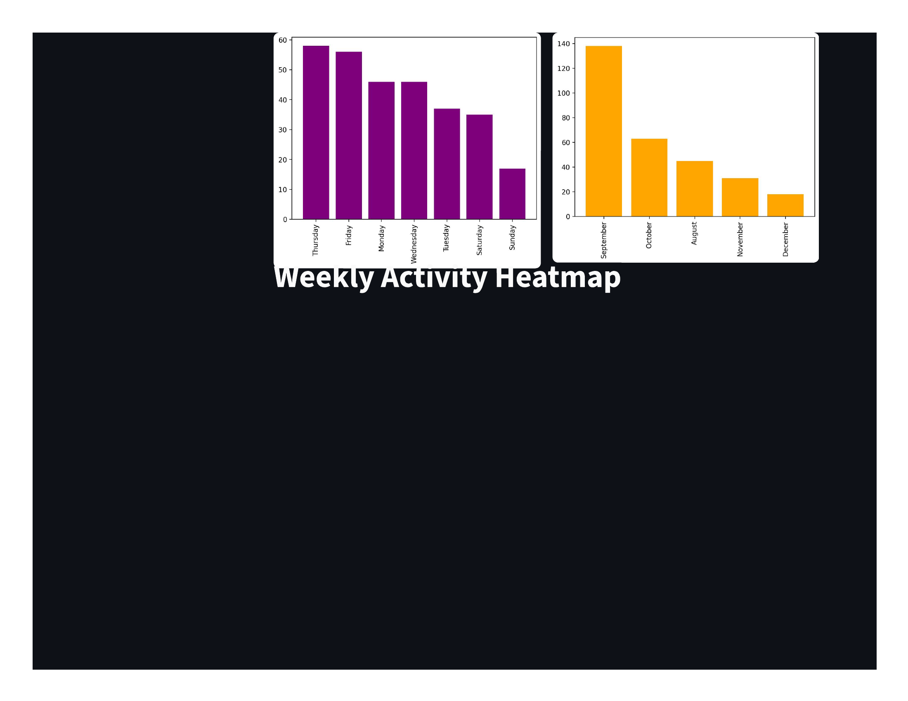
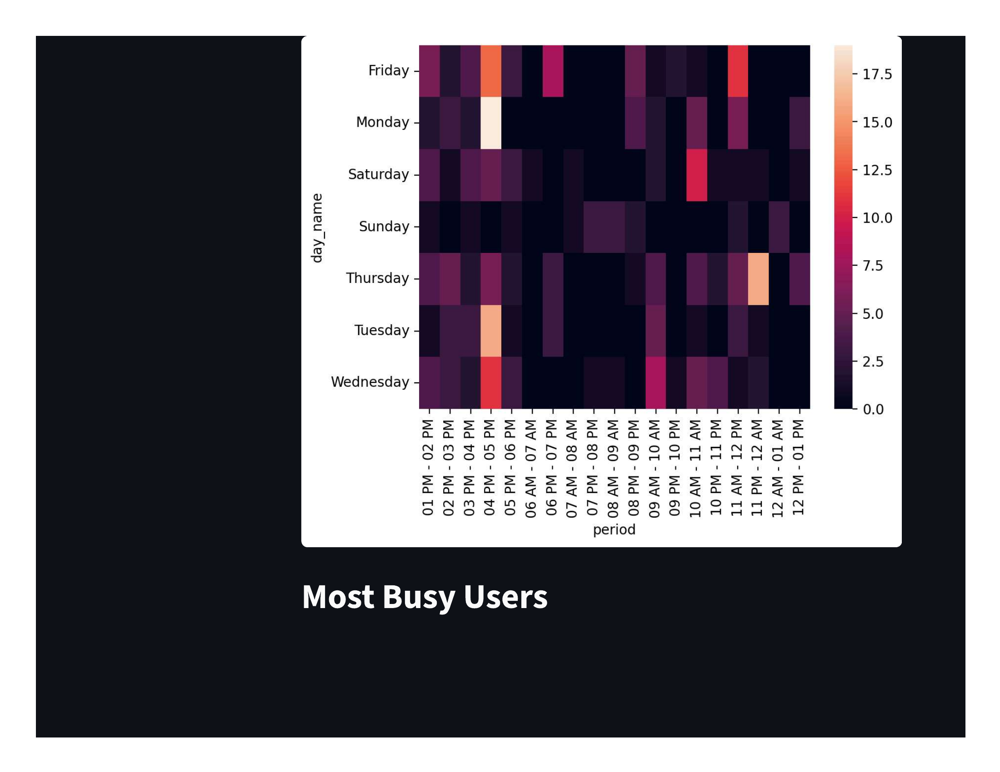
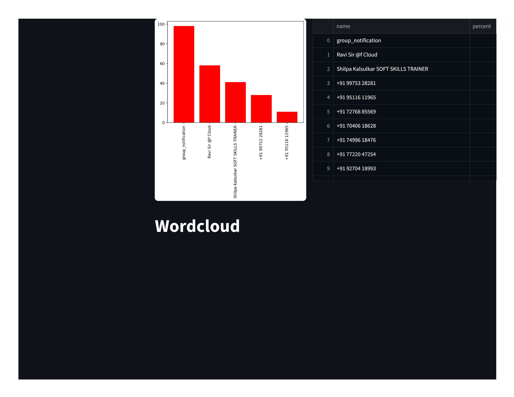
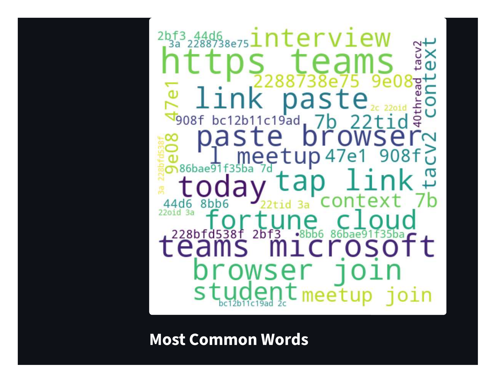
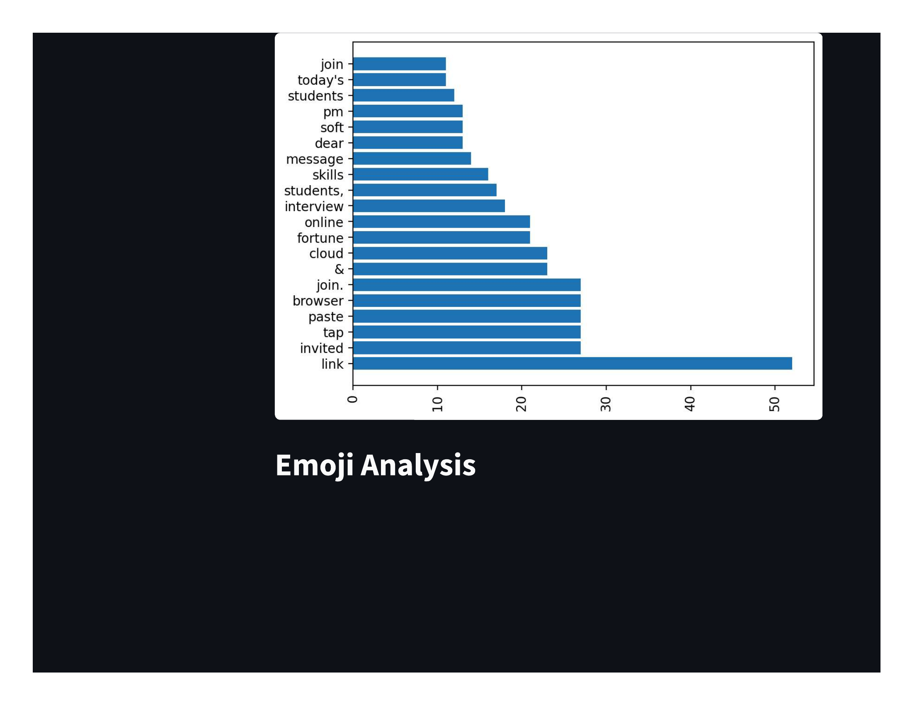
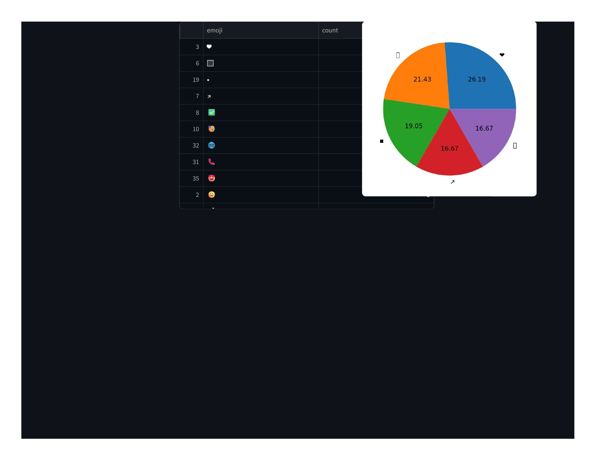

# 📊 WhatsApp Chat Analyzer

A powerful, interactive WhatsApp Chat Analyzer built using **Python**, **Pandas**, and **Streamlit**.  
This project helps you uncover chat patterns, user activity, emoji usage, most common words, and much more — all from your exported WhatsApp chats.

---

## 🚀 Features

### 🔍 **Message Insights**
- Total messages  
- Total words  
- Media shared  
- Links shared  

### 📅 **Timeline Analysis**
- Monthly message timeline  
- Daily activity timeline  

### 📆 **Activity Patterns**
- Most active day  
- Most active month  
- Weekly activity heatmap  

### 🧑‍🤝‍🧑 **Top Contributors**
- Most active participants  
- Message percentage share  

### ☁️ **Text Analysis**
- WordCloud generation  
- Most common words  
- Stop-word filtering (Hinglish supported)  

### 😀 **Emoji Analysis**
- Total emoji usage  
- Most frequently used emojis  
- Emoji pie chart  

### 🗂️ **Supports both:**
- **24-hour timestamps**  
- **12-hour AM/PM timestamps**  
- **.txt chat files**  
- **.zip exported chats**  

---

## 🛠️ Tech Stack

| Component | Technology |
|----------|------------|
| Frontend UI | Streamlit |
| Data Processing | Pandas |
| Visualization | Matplotlib, Seaborn |
| Text Handling | WordCloud, Regex |
| Emoji Analysis | emoji.py |
| URL Extraction | urlextract |

---

## 📄 WhatsApp Chat Analysis – Output (Images)

### Page 1

### Page 2

### Page 3

### Page 4

### Page 5

### Page 6

### Page 7

### Page 8

### Page 9

 
